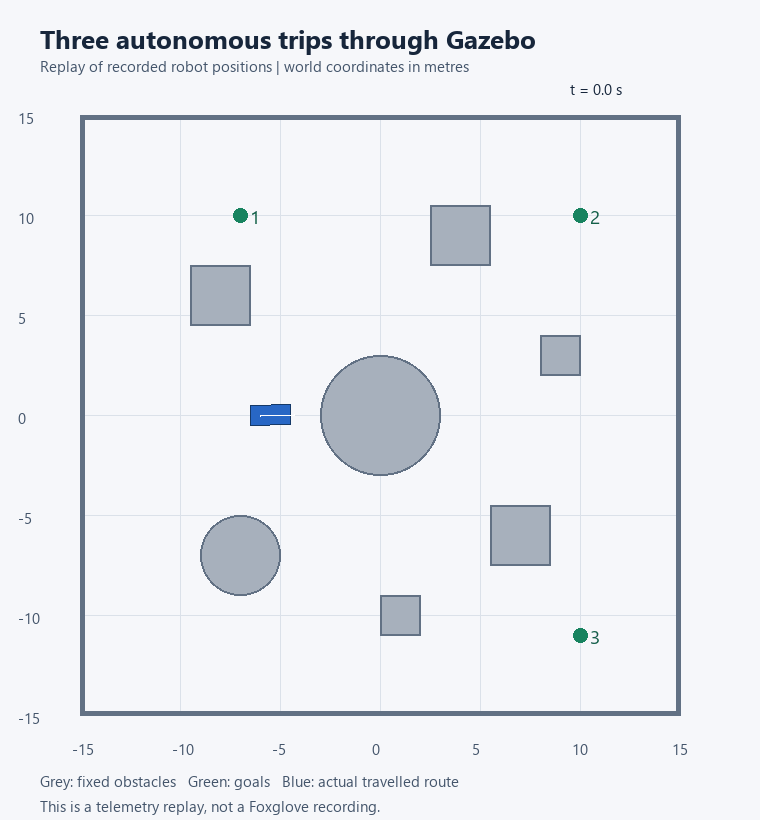

# WATonomous ASD Assignment

This project makes a simulated robot drive to a chosen point while avoiding obstacles. It uses C++, ROS 2, Gazebo, and Foxglove, based on the [WATonomous starter code](https://github.com/WATonomous/wato_asd_training).

## How it works

The navigation code is in `src/robot/` and has four main parts:

- **Costmap:** uses LiDAR distance readings to mark obstacles on a small grid. It adds extra space around them so the robot has room to pass.
- **Map memory:** saves these readings in a larger map as the robot moves.
- **Planner:** uses A* to find a route from the robot to the goal. It updates the route as the map changes.
- **Control:** uses Pure Pursuit to steer towards a point ahead on the route, then stops near the goal.

The simulation supplies the robot's position. Foxglove shows the LiDAR, map, route, and robot movement.

## Running it

In a Linux or WSL Ubuntu terminal, from this project folder:

```bash
docker compose -f compose.learning.yaml build robot
docker compose -f compose.learning.yaml up -d
```

In Foxglove, choose **Foxglove WebSocket** and connect to `ws://localhost:8766`. Import `config/clean-demo.foxglove.json` for the simpler display.

Use **Publish point** on `/goal_point` with the frame `sim_world` to choose a destination. The robot then drives itself; the joystick is for manual control.

See [setup instructions](docs/RUNNING.md) for the full steps and commands.

## Main challenges

- Keeping obstacle positions lined up as the robot turns and moves.
- Leaving enough room around obstacles for the whole robot.
- Using the robot body's position for steering instead of the LiDAR's position.
- Stopping when there is no route or the required data stops arriving.

The [design notes](docs/DECISIONS.md) explain these choices and the current limitations.

## Testing and demo

The code built successfully and passed 20 algorithm checks. The robot reached four tested destinations in Gazebo, and a goal inside an obstacle kept it stopped. Live Foxglove runs were recorded in Chrome using OBS.

See [test results](docs/VERIFICATION.md) for the evidence and [recording setup](docs/CLEAN-RECORDING.md) for the display settings. The MP4 videos are saved separately and are not included here.



This animation uses recorded robot positions. It is not the Foxglove screen recording.

## Limitations

This version is intended for the supplied room with stationary obstacles. Old obstacle marks stay in the map until it is reset. The map has a fixed size, and the robot does not have a recovery strategy for every situation where it gets stuck.

## Credits

- WATonomous provided the assignment, starter code, and simulation. [Assignment instructions](https://wiki.watonomous.ca/admission_assignments/asd_admission_assignment/).
- AI assistance was used for the navigation code, tests, debugging, and documentation.
- The original [Apache 2.0 license](LICENSE) is retained.
