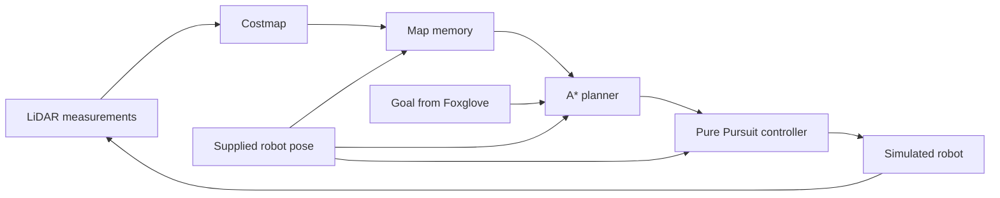

# WATonomous ASD: LiDAR navigation

An implementation of the WATonomous Autonomous Software Division onboarding assignment using ROS 2, C++, Gazebo, and Foxglove.

The simulated robot receives a destination, builds a map from laser scans, plans a route around static obstacles, and follows it. Foxglove displays the sensor readings, maps, route, and movement commands.

## Documentation

| What you want to do | Where to go |
|---|---|
| Run it and connect Foxglove | [Setup, commands, and troubleshooting](docs/RUNNING.md) |
| Understand the engineering tradeoffs | [Decisions and limitations](docs/DECISIONS.md) |
| See what was actually verified | [Verification report](docs/VERIFICATION.md) |
| Reproduce the cleaner video display | [Recording and layout guide](docs/CLEAN-RECORDING.md) |

## Task and scope

The goal is point-to-point navigation in the provided static Gazebo environment. Position is supplied by the simulation. The implementation uses the laser scanner for obstacles; it does not implement camera perception, localization, or SLAM.

The official assignment and starter infrastructure are maintained by [WATonomous](https://github.com/WATonomous/wato_asd_training). See the [assignment instructions](https://wiki.watonomous.ca/admission_assignments/asd_admission_assignment/) for the original specification.

## Architecture



| Component | Input | Output | Responsibility |
|---|---|---|---|
| Costmap | `/lidar` | `/costmap` | Convert distances to grid cells and add obstacle clearance |
| Map memory | `/costmap`, pose/TF | `/map` | Transform observations into a persistent world grid |
| Planner | `/map`, `/goal_point`, `/odom/filtered` | `/path` | Search for a route and replan |
| Control | `/path`, `/odom/filtered`, `/lidar` | `/cmd_vel` | Track the route and stop when appropriate |

## Repository layout

```text
config/learning.foxglove.json     Importable Foxglove layout
compose.learning.yaml           Isolated local development/demo setup
docs/                           Setup, design decisions, verification, recording
evidence/                       Actual test results and recorded telemetry
scripts/check_navigation.py     End-to-end simulator probe
src/robot/
  costmap/                      LiDAR processing
  map_memory/                   Persistent grid
  planner/                      A* search
  control/                      Pure Pursuit and stopping logic
  odometry_spoof/                Supplied pose helper, adjusted to body frame
  bringup_robot/                Launches the nodes
  navigation_tests/             Algorithm checks and warm-up publisher
src/gazebo/                     Original simulated world
```

Each navigation package separates its ROS communication (`*_node`) from its algorithm (`*_core`). Headers declare interfaces; source files implement them.

## Quick start

From this directory in Linux/WSL, with Docker running:

```bash
docker compose -f compose.learning.yaml build robot
docker compose -f compose.learning.yaml up -d
docker compose -f compose.learning.yaml run --rm robot \
  ros2 run navigation_tests navigation_checks
```

Connect Foxglove using **Foxglove WebSocket** at `ws://localhost:8766` and import `config/learning.foxglove.json`. Use `sim_world` as the display frame and publish a point on `/goal_point` to choose a destination.

Full commands, Windows paths, manual goals, the warm-up, and stopping instructions are in [RUNNING.md](docs/RUNNING.md).

## Challenges addressed

- **Coordinate frames:** sensor-relative measurements must be rotated and translated into world coordinates.
- **Robot geometry:** the front-mounted LiDAR is not the correct body reference for steering; its offset matters.
- **Unknown space:** unseen cells must remain distinguishable from observed free space.
- **Clearance:** a route for a point must leave room for the entire robot.
- **Planning edge cases:** blocked goals, unreachable areas, and diagonal corner cutting need explicit handling.
- **Changing information:** the route must update as new obstacles appear in the map.
- **Stopping:** empty paths and missing inputs must cancel motion.
- **Development environment:** C++ compilation, ROS dependencies, containers, and Windows/Linux line endings are separate concerns.

The guide connects these challenges to actual code and the validation checks.

## Configuration

Parameters are in each package's `config/params.yaml`. Defaults include 0.2-metre local cells, 0.25-metre global cells, 2-metre blocked clearance, 0.65-metre lookahead, 0.6 m/s maximum speed, and 0.35-metre goal tolerance. Rebuild the robot image after editing these files.

## Validation and demonstration

See [VERIFICATION.md](docs/VERIFICATION.md) for the tested build, algorithm results, simulation destinations, and any unverified UI steps. Evidence is local. Status statements should be updated when the code or configuration changes.

Verified: successful C++ build, 20 algorithm checks, actual receipt of the warm-up messages, four reached simulation destinations, stopped behaviour, and local Foxglove bridge streaming. Live visualization was subsequently verified in Chrome and recorded with OBS. A separate cleaner recording shows a trip to (-10, -11) and a confirmed stop. See the verification report for the recording-run timeout and continuation details.

For the cleaner display, import `config/clean-demo.foxglove.json` and select Dark appearance in Foxglove. The MP4 recordings are saved separately in the local outputs folder and are not uploaded with this repository.


This animation replays actual recorded odometry; it is not a Foxglove screen capture. A full ROS recording is retained locally in `evidence/rosbag-demo/` but is excluded from Git because of its size. The MP4 screen recordings are also separate from the repository.

## Known limitations

The mapper retains the highest observed cost, so it cannot clear moved obstacles or persistent false detections. The map has fixed bounds. The circular footprint is conservative. The robot has no recovery behaviour for every possible dead end or control failure. This is a static-world assignment implementation, not production autonomous driving software.

## Credits and assistance

- WATonomous: assignment, original repository, simulation, infrastructure, and starter layout.
- AI assistance: navigation implementation, tests, debugging, and explanatory material in this local version.

## License

See [LICENSE](LICENSE), retained from the upstream repository.
