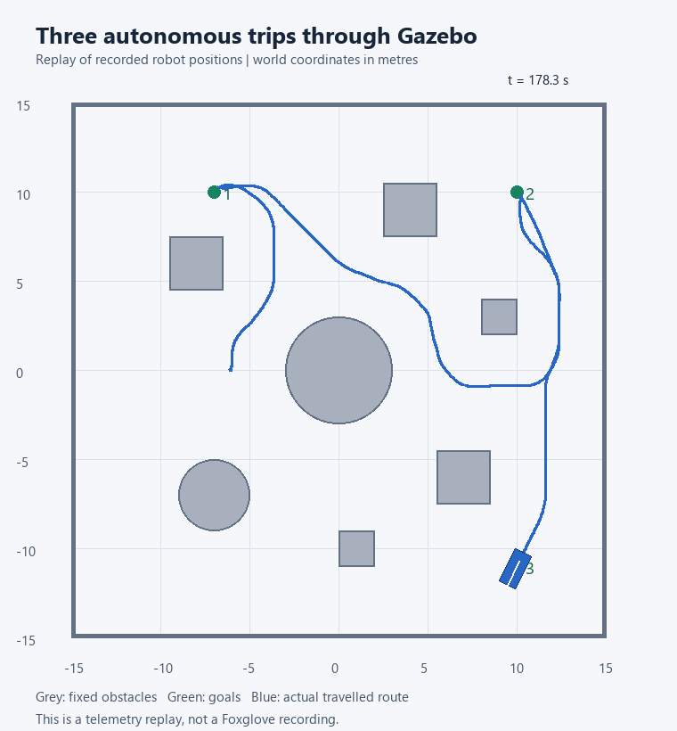
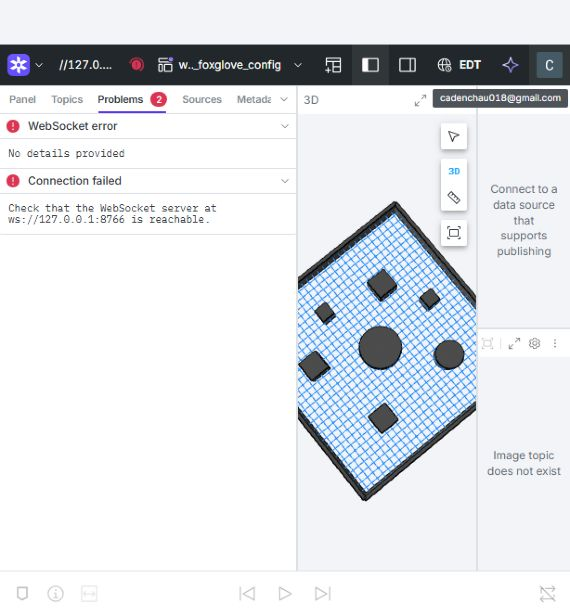

# Verification report

Tested locally on September 25–26, 2026 (America/Toronto).

## Subsequent Chrome recordings

Live Foxglove visualization was successfully connected in Chrome at `ws://127.0.0.1:8766` and captured with OBS. This supersedes the earlier pending live visual check described below; offline bag playback was not separately verified.

The first screen recording reached all three destinations. Its second goal exceeded the probe's 180-second wall-clock timeout while the robot was still progressing. The probe was restarted with a longer timeout for the remaining goals, which then succeeded. See [initial results](../evidence/recording-first-goals.json) and [continuation results](../evidence/recording-continuation.json). Do not interpret this recording as an uninterrupted passing three-goal test.

The cleaner recording starts from the previous final position near (10, -11), retains the accumulated map, and drives to (-10, -11). The probe reported arrival at 0.397 metres; a subsequent `/cmd_vel` observation confirmed all linear and angular components were zero. See [clean run telemetry](../evidence/clean-demo.json) and [display instructions](CLEAN-RECORDING.md). OBS finalized both local MP4 files. Neither was uploaded or published.

## Environment

- Windows host with Ubuntu 26.04 under WSL 2 and Docker 29.8.1.
- ROS 2 Humble inside the official assignment's Ubuntu 22.04 containers.
- Starter commit: `3faa008f659ba0bc32ef223eeed6343c7b3c4628`.
- Separate Compose project `asd_learning`, ROS domain 67, and Gazebo partition `asd_learning`.
- Local Foxglove endpoint: `ws://localhost:8766`.
- The simulated world installed in the tested image was compared with the repository's `robot_env.sdf` and matched after text newline normalization.

## Build and algorithm checks

The convenience Docker build compiled all seven ROS packages, including the warm-up publisher and test executable. The captured build log is [build.log](../evidence/build.log).

All **20 algorithm checks passed**, covering scan validity, observed versus unknown space, inflation, map rotation/translation, map bounds, obstacle memory, A* detours and failures, diagonal corner cutting, and controller direction/stopping. Full output: [algorithm-checks.txt](../evidence/algorithm-checks.txt).

The warm-up publisher sent three messages that a separate ROS subscriber actually received. Full output: [warmup-check.txt](../evidence/warmup-check.txt).

The alternative upstream `watod` image-building path was configured but was not separately rebuilt end to end. The successful build used `compose.learning.yaml` and the cached official runtime dependencies.

## Autonomous navigation

Three sequential goals were reached in the provided Gazebo room:

| Goal in metres | Distance when the probe first reported arrival |
|---|---:|
| `(-7, 10)` | 0.394 m |
| `(10, 10)` | 0.392 m |
| `(10, -11)` | 0.392 m |

The probe uses a 0.4-metre observation threshold, then allows two seconds to settle. The controller itself uses 0.35 metres. At the end of the recording, the robot was approximately `(10.141, -10.701)`, 0.330 metres from the final goal, and both velocity commands were zero.

The run contains **1,784 actual odometry samples over 178.3 seconds**. It is not a hand-authored route animation.

- [Raw navigation telemetry](../evidence/navigation-run.json)
- [Goal-result log](../evidence/simulation-checks.txt)
- [Animated telemetry replay](../evidence/telemetry-replay.gif)
- [Trajectory image](../evidence/actual-trajectory.png)

## Obstacle clearance

A geometric check against the verified static world found a minimum robot-reference-point distance of 2.348 metres from obstacle surfaces and walls at the recorded samples. A circle enclosing the model's body has radius approximately 1.581 metres, leaving a minimum sampled margin of 0.767 metres.

This is evidence of clearance along the sampled trajectory. It is not a continuous collision proof or a Gazebo contact-sensor log. [Calculation results](../evidence/trajectory-summary.json).

## Stopping

After arrival, the robot was confirmed stopped. A goal at `(0, 0)`, inside the central cylinder, then produced zero commands throughout 131 command observations, with no position drift during the observation window. [Stopping results](../evidence/stopping-check.json).

The stale-input watchdog and forward scan guard are implemented, but a separate injected sensor-failure test was not performed. The core checks and this live test do not establish real-world safety.

## Foxglove connection

A direct local WebSocket test passed from WSL and Windows: all navigation topics were advertised and a binary LiDAR message was received. [Bridge results](../evidence/foxglove-bridge-check.json).

The installed bridge is `ros-humble-foxglove-bridge 3.5.0-1jammy.20260908.091358`. Its SDK protocol differs from the old protocol used in many examples. The smoke-test client offers both supported protocol names; see the [SDK handshake source](https://docs.rs/foxglove/latest/src/foxglove/websocket/handshake.rs.html).

The Foxglove web session was signed in and the existing WATonomous layout selected. The embedded browser's live connection failed its handshake even though the same endpoint worked from both local command-line clients. This is recorded as a UI compatibility limitation, not a successful live visual check. Use the current Foxglove desktop app or a regular supported browser if this occurs.

## Local recording for later inspection

A fourth autonomous trip to `(-10, -11)` reached `(-10.235, -10.769)` and stopped. Its complete ROS recording is in [evidence/rosbag-demo](../evidence/rosbag-demo/), with metadata and a SQLite `.db3` file. It contains scans, grids, paths, poses, movement commands, transforms, and the goal. Recording output is retained in [recording-check.txt](../evidence/recording-check.txt).

Use **Open local file(s)** in Foxglove to open `asd-learning-demo_0.db3`. This processes the file locally; do not choose the separate upload/share option. The embedded browser's file chooser did not become available through the automation interface, so offline visual inspection is also still to be completed in a regular browser or desktop app. The bag metadata and successful recorder shutdown confirm that the file was recorded and finalized; no claim is made that its Foxglove rendering was verified.

## Image identities

These are local image IDs, recorded for traceability rather than registry pull digests:

| Official image | Local image ID |
|---|---|
| `robot:main` | `sha256:db96aaa082da3a945936fa1f61f70a659f81ff83d1937293afb871e12887abfd` |
| `gazebo_server:main` | `sha256:d23771e875cea4145acb6be357acfaf65b831676b7c40bd632858f10672698c1` |
| `infrastructure_foxglove:main` | `sha256:8c000c80379fd797c2007610a0d94d6c5643af118ee2960faab807013d2f15df` |

All three are under `ghcr.io/watonomous/wato_asd_training/`.

## Scope of the result

The local code builds, algorithm checks pass, and autonomous motion was demonstrated in the supplied simulator. The earlier user checkout and its running containers were preserved. No repository, recording, or submission was published or sent to another person.
